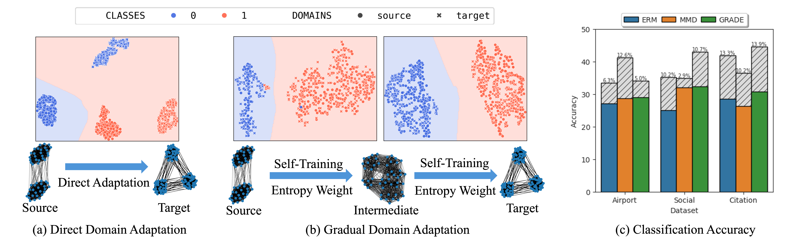
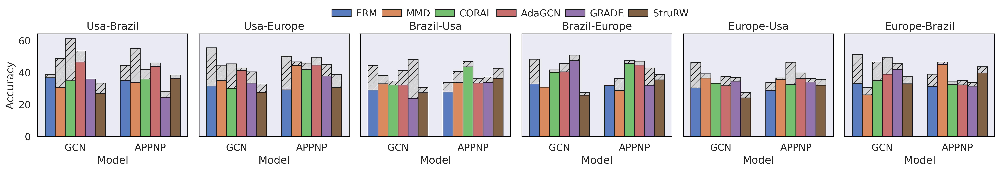
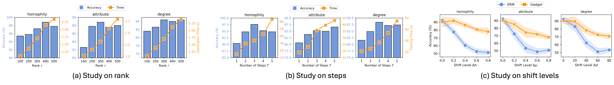

# Gadget (Pave Your Own Path: Graph Gradual Domain Adaptation on Fused Gromov-Wasserstein Geodesics)

<p align="center">
    <a href="https://arxiv.org/pdf/2505.12709">
</a>


## 💡 Introduction
This is the official repo for the paper [Pave Your Own Path: Graph Gradual Domain Adaptation on Fused Gromov-Wasserstein Geodesics](https://arxiv.org/pdf/2505.12709) in TMLR.

<a name="readme-top"></a>

<p align="center">
  <picture>
    <source media="(prefers-color-scheme: dark)" srcset="assets/overview.png">
    
  </picture>
</p>


Gadget is first graph gradual domain adaptation framework that robustifies GNN performance against large distribution shifts. Gadget serves as a plug-and-play technique that can be seamless integrated with diverse graph adaptation methods and GNN models.


## 📊 Experiment Overview

We evaluate adaptation results with (hatched bars) and without (colored bars) Gadget on diverse benchmark datasets.
- **Adaptation results**: Gadget consistently enhances graph adaptation methods across diverse datasets
<p align="center">
  <picture>
    <source media="(prefers-color-scheme: dark)" srcset="assets/benchmark.png">
    
  </picture>
</p>

- **Studies** on different ranks $r$, steps $T$ and shift levels.
<p align="center">
  <picture>
    <source media="(prefers-color-scheme: dark)" srcset="assets/study.png">
    
  </picture>
</p>

## ⚙️ Environment Setup
### 1. Clone the repository
```
  git clone https://github.com/zhichenz98/Gadget-TMLR
  cd Gadget-TMLR
```

### 2. Install packages
```
  conda create -n gadget python=3.10 -y
  conda activate gadget
  pip install torch==2.1.0+cu118 torchvision==0.16.0+cu118 torchaudio==2.1.0+cu118 --index-url https://download.pytorch.org/whl/cu118
  conda install -y -c dglteam/label/th21_cu118 dgl
  conda install -y -c conda-forge matplotlib pandas pydantic scikit-learn pot "numpy<2.0"
  pip install pyyaml torchdata==0.7.1
```

### 3. Download datasets
Our datasets are available at [here](https://drive.google.com/drive/folders/17BF7jySCihQmO5u2xzHlouADOioYrFq-?usp=drive_link). You may also download via gdown.
```
  gdown --folder https://drive.google.com/drive/folders/17BF7jySCihQmO5u2xzHlouADOioYrFq-
```

## 🧪 Running Experiments

#### Option 1: Run via command
```
python src/main.py --data airport --method VANILLA --aug gadget --cuda 0
```
- **```--data```**: experiment dataset; choose from ```airport, social```.
- **```--method```**: adaptation methods; choose from ```VANILLA, AdaGCN, CORAL, GRADE```.
- **```--aug```**: augmentation technique; choose from ```base, gadget```.

#### Option 2: Run via bash file
```
bash $METHOD.sh
```

## 📚 Citation
💫 If you find **Gadget** helpful, please kindly give us a star and cite below. Thanks!
```
  @article{zeng2025pave,
    title={Pave Your Own Path: Graph Gradual Domain Adaptation on Fused Gromov-Wasserstein Geodesics},
    author={Zeng, Zhichen and Qiu, Ruizhong and Bao, Wenxuan and Wei, Tianxin and Lin, Xiao and Yan, Yuchen and Abdelzaher, Tarek F and Han, Jiawei and Tong, Hanghang},
    journal={arXiv preprint arXiv:2505.12709},
    year={2025}
  }
```
